# Fast photographic style transfer

This is the torch implementation code for the fast photographic style transfer based on Fast-Neural-Style (http://cs.stanford.edu/people/jcjohns/eccv16/)


Stylizing an image at a resolution of 852x480 approximately takes **1.40 seconds** on a single GTX 1080Ti Card:

<div align='center'>
  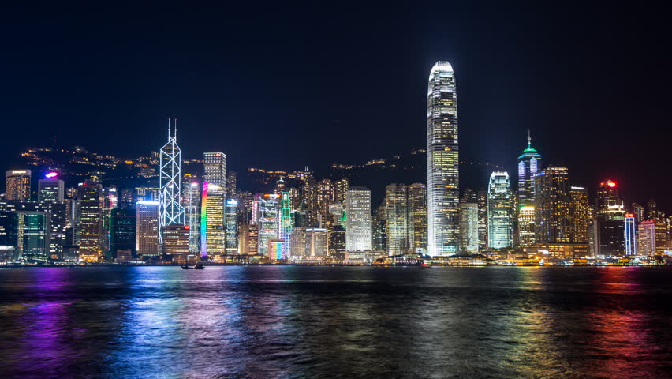
  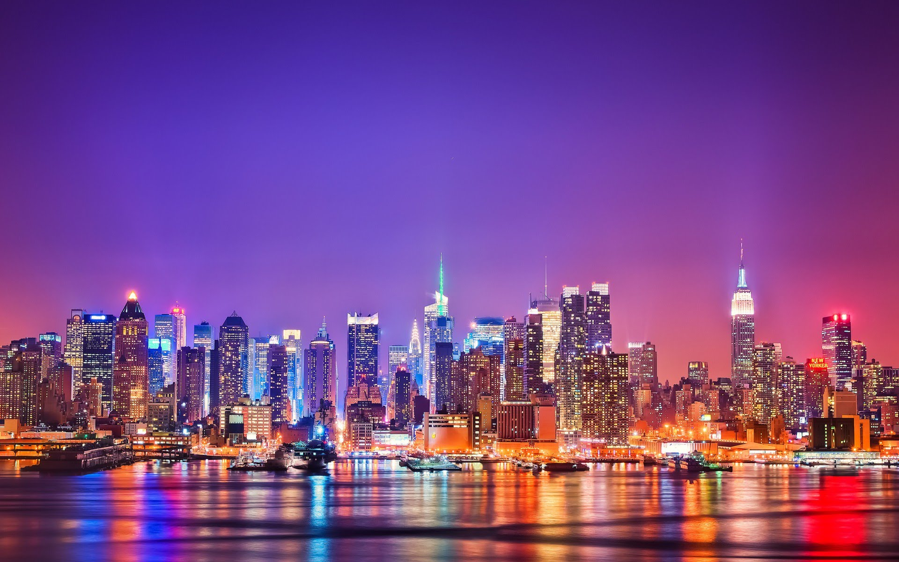
  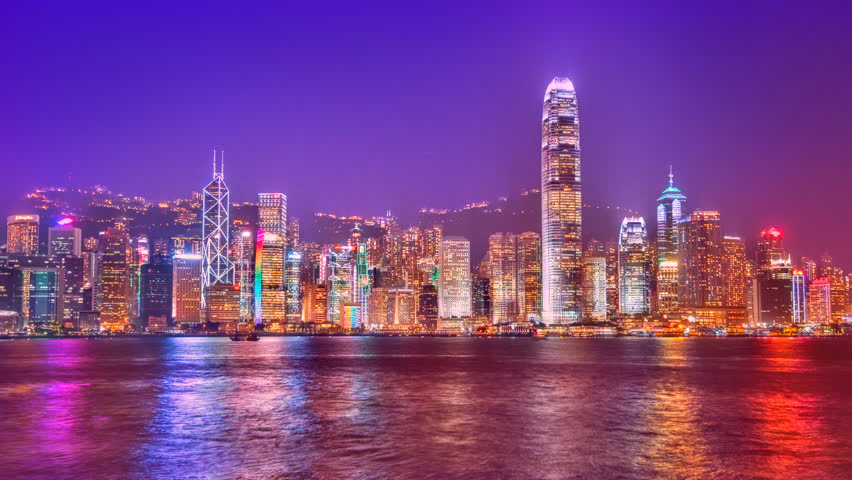
  <br>
</div>

In this repo, we also provide the torch implementation of the Domain Transform (Recursive Filter) described in the paper:

    Domain Transform for Edge-Aware Image and Video Processing
    Eduardo S. L. Gastal and Manuel M. Oliveira
    ACM Transactions on Graphics. Volume 30 (2011), Number 4.
    Proceedings of SIGGRAPH 2011, Article 69.


## Setup
All code is implemented in Ubuntu 16.04 with [Torch7](http://torch.ch/) and Lua5.1, thus some necessary 
packages need to be updated or installed.

First. [Install Torch](http://torch.ch/docs/getting-started.html#installing-torch), then
update / install the following packages:

```bash
luarocks install torch
luarocks install nn
luarocks install image
luarocks install lua-cjson
```

Second. [Install Cuda](https://developer.nvidia.com/cuda-zone), if you have an NVIDIA GPU and want to 
accelerate all operations with CUDA. Then update / install the following packages:
```bash 
luarocks install cutorch
luarocks install cunn
```

Third. [Install cuDNN](https://developer.nvidia.com/cudnn) to accelerate your convolution operations when using CUDA.
You can copy the cuDNN libraries to `/usr/local/cuda/lib64/`. Then install the Torch bindings for cuDNN:
```bash
luarocks install cudnn
```

### Pretrained Models
The pre-trained models are located in **./models/pre-trained/**


## Running examples

The script **fast_photographic_style_transfer_single.sh** lets you use a trained model to 
stylize example images:
```bash
bash fast_photographic_style_transfer_single.sh

```
### Running on new images
Change the image paths in **fast_photographic_style_transfer_single.sh** allow you to use a trained 
model to stylize new images:
```bash
th fast_neural_style.lua \
  -model ./models/pre-trained/newyorknight.t7 \
  -image_size 700 \
  -width 0 \
  -median_filter 3 \
  -timing 1 \
  -input_image [path to your content image] \
  -output_image [path to your temporal output image] \
  -gpu 0

th StyleFusion.lua \
  -Type single \
  -content_image [path to your content image] \
  -stylized_image [path to your temporal output image] \
  -output_image [path to your final output image]
```

### Running on videos
Change the video and frame paths in **fast_photographic_style_transfer_video.sh** allow you to use a trained 
model to stylize a new video:

```bash
ffmpeg -i [path to your video] [path to your frames]/frame_%04d.ppm

th fast_neural_style.lua \
  -model ./models/pre-trained/newyork_night.t7 \
  -image_size 700 \
  -width 0 \
  -median_filter 3 \
  -timing 1 \
  -input_dir [path to your frames]/frame_%04d.ppm \
  -output_dir [path to your tmp stylized frames] \
  -gpu 0

th StyleFusion.lua \
  -Type video \
  -input_pattern [path to your frames]/frame_%04d.ppm \
  -stylized_pattern [path to your tmp stylized frames]/frame_%04d.ppm \
  -output_pattern [path to your final frames]/frame_%04d.png


ffmpeg -i [path to your final frames]/frame_%04d.png [path to your video output]/stylized.mp4
```


### Some example results


<div align='center'>
  
  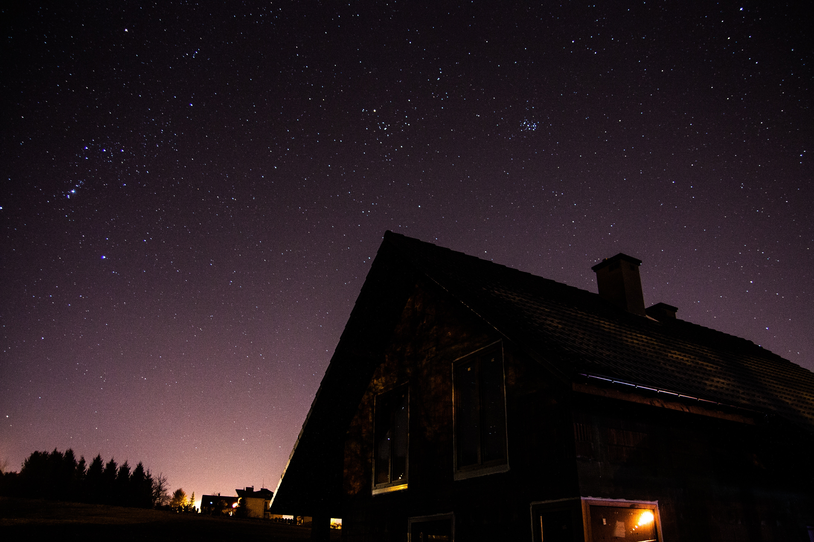
  
  <br>
  
  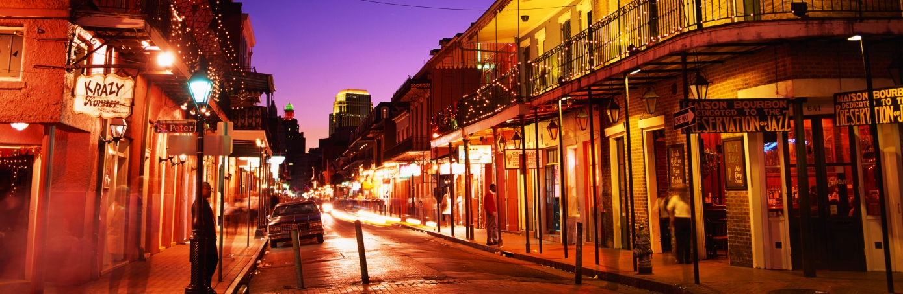
  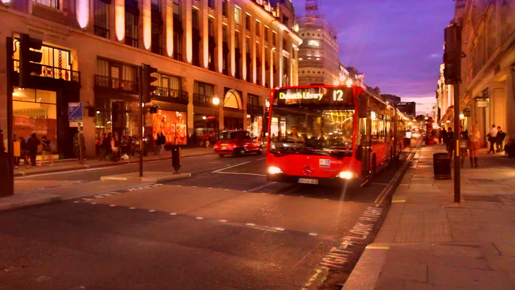
  <br>
  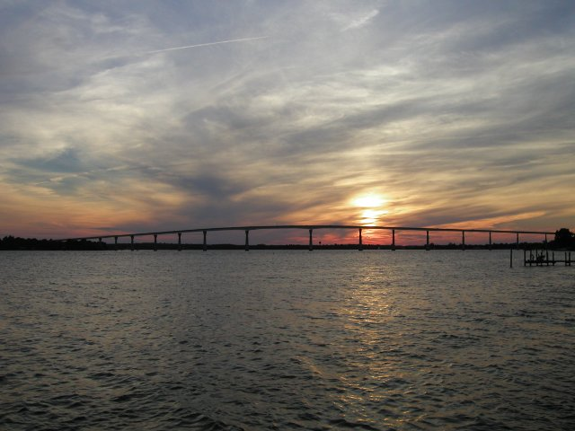
  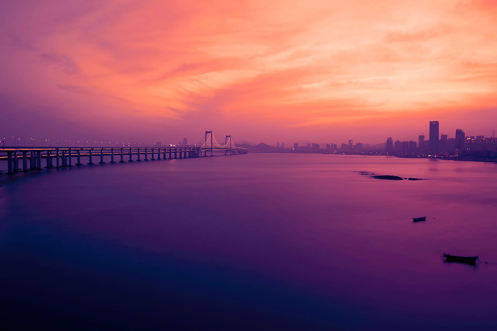
  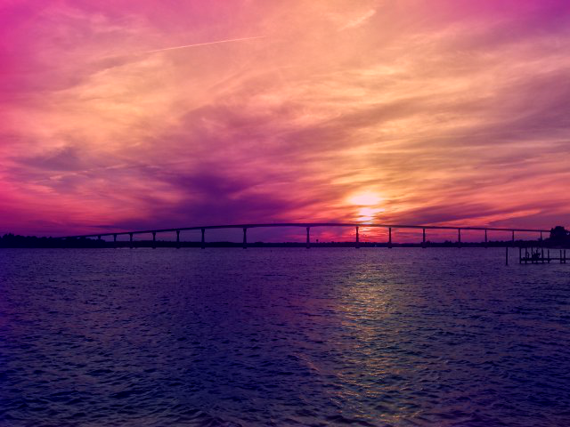
  <br>
  
  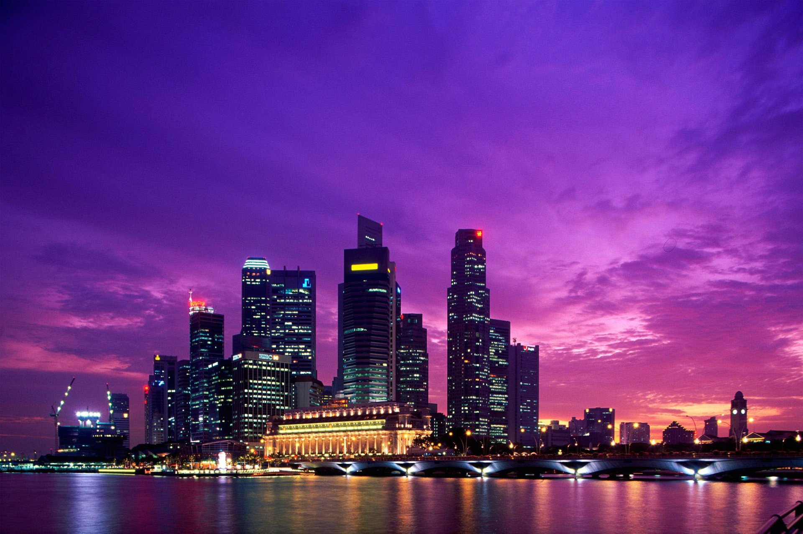
  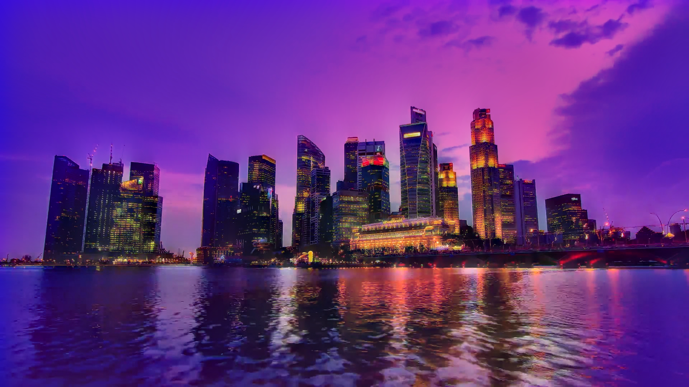
  <br>
  
  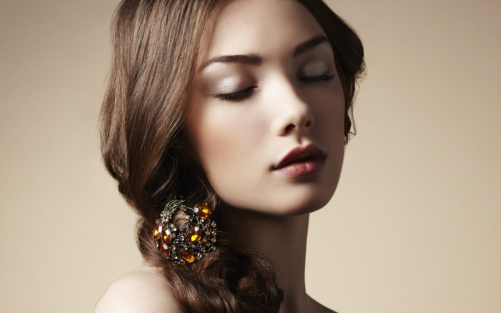
  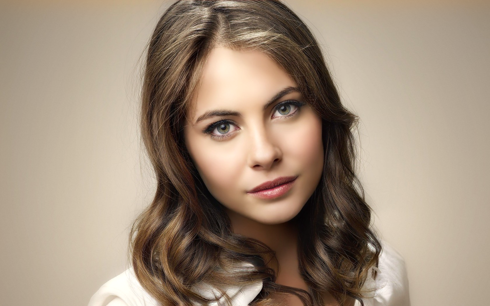
</div>


## Parameters

You can control the size of the output images using the `-image_size` flag.

By default this script runs on CPU; to run on GPU, add the flag `-gpu`
specifying the GPU on which to run.

The full set of options for this script is [described here](doc/flags.md#fast_neural_stylelua).


## Training new models

You can find instructions for training new models [here](doc/training.md).

The training example is described in 'run_train.sh'.


The code builds on
[Perceptual Losses for Real-Time Style Transfer and Super-Resolution](http://cs.stanford.edu/people/jcjohns/eccv16/)
by Justin Johnson, Alexandre Alahi, and Li Fei-Fei.

## License

Free for personal or research use; for commercial use please contact me.
